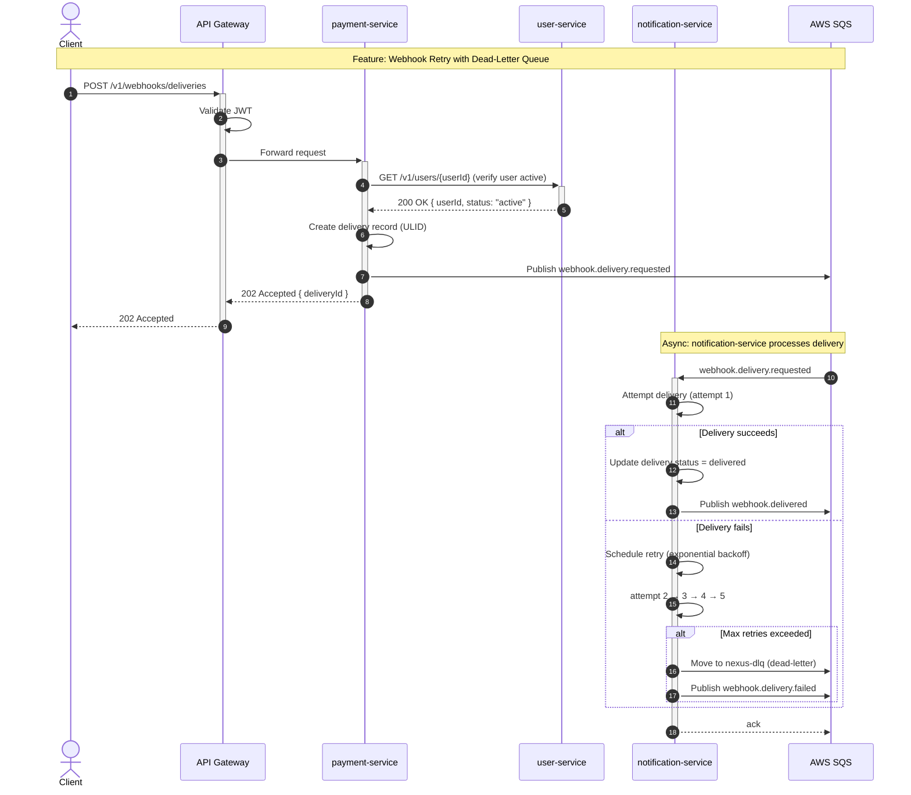

# Skill: design-sequence-diagram

> **[CAPABILITY: SKILLS]**
> Invoke with `/design-sequence-diagram` or ask Claude to "draw a sequence diagram".
> The architect agent invokes this when a new multi-service flow is introduced.

## When to Use

Invoke when:
- A new feature involves 2+ services communicating
- Documenting an existing flow that lacks visual documentation
- An incident revealed unexpected service interaction order

## Output

Produce:
1. A Mermaid sequence diagram in a `docs/diagrams/{flow-name}.md` file
2. A brief prose explanation of the happy path and key edge cases

## Mermaid Template

## Rules

1. Use `autonumber` — makes it easy to reference steps in ADRs and postmortems.
2. Label participants with short names (GW, PS, US) and full names in the `as` clause.
3. Use `Note over` boxes to separate logical phases (sync vs async, normal vs error).
4. Always show the error/retry path — not just the happy path.
5. Save as `.md` with the Mermaid block — renders in GitHub and most wikis.
6. Cross-reference the diagram in the relevant ADR.
