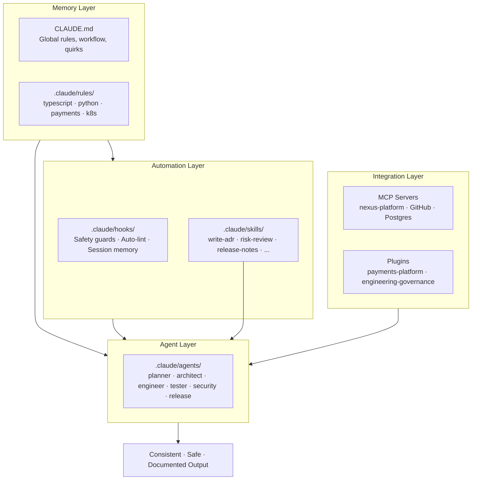
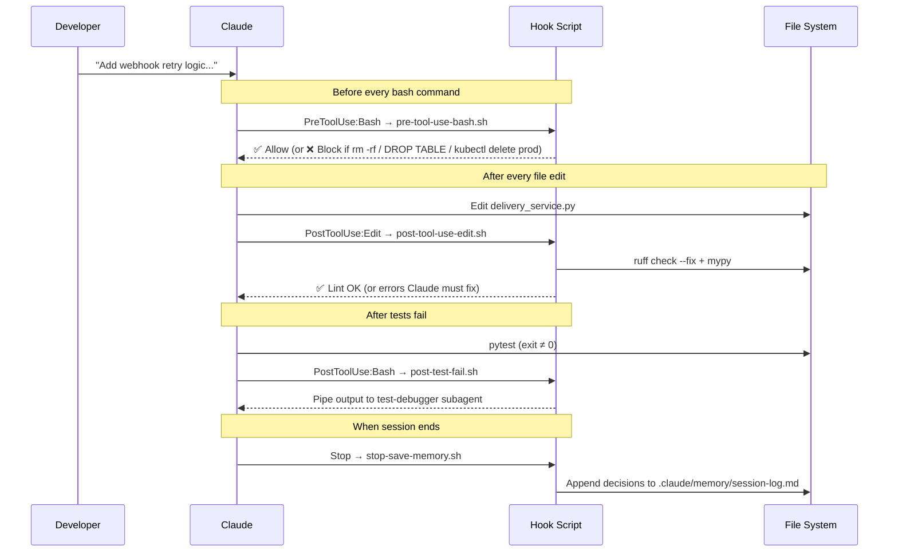
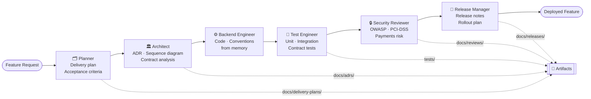
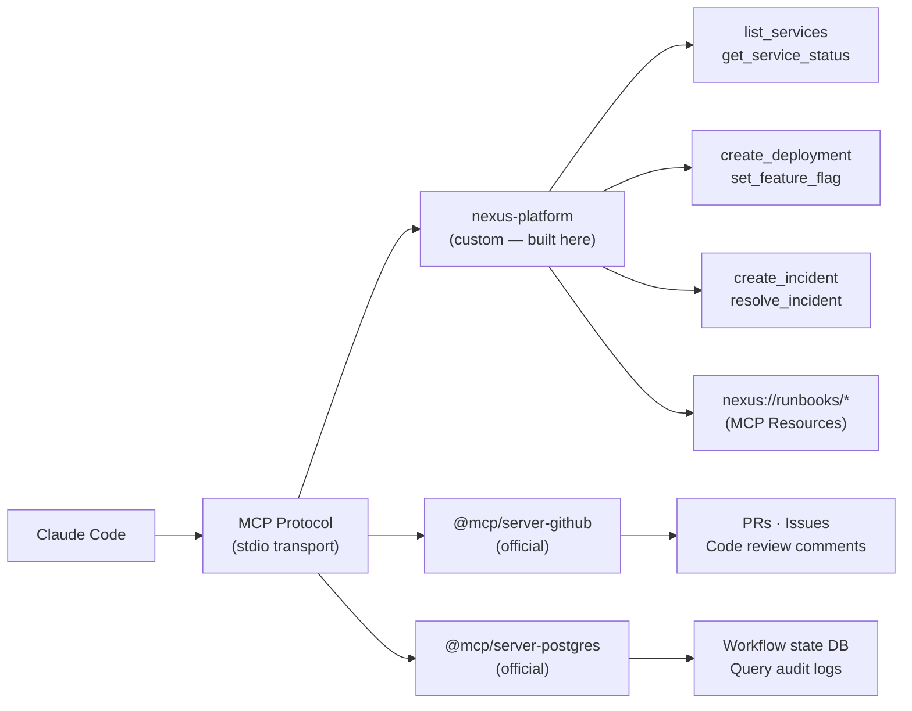

# Your Team is Using Claude Wrong — Here's How to Fix It

*A complete guide to structuring Claude Code for real engineering teams, with a working reference project you can clone today.*

---

## The Story Every Engineering Team Knows

It starts on a Monday morning. Someone on your team opens Claude Code and asks it to add a new feature. The code comes back fast — impressively fast. The team is excited.

By week four, the cracks appear.

A developer asks Claude to add a new entity to the payments service. It comes back with `crypto.randomUUID()`. Your team uses ULID. The PR gets a review comment. The developer goes back to Claude to fix it. Claude uses UUID again next time because it already forgot.

Another developer asks Claude to add an endpoint. The error handling uses `throw new Error()`. Your team uses Result types with `neverthrow`. Another code review failure. Another round trip.

Someone asks Claude to help prepare a release. It produces notes with no rollout strategy, no rollback plan, no mention of the feature flags that need to be toggled first. A senior engineer spends forty minutes filling in what's missing.

By week twelve, the honest conversation in your team sounds like this:

> "It's useful for small things — autocomplete, boilerplate, explaining unfamiliar code. But for anything real, it's faster to just write it ourselves than to correct what Claude produces."

**AI adoption has stalled.** Not because Claude isn't capable. Because every session starts from zero and every developer gets inconsistent results.

This is the problem we set out to solve.

---

## The Root Cause

Here is the thing most teams miss: Claude isn't the problem. The problem is that **Claude has no persistent understanding of your team.**

Every time a developer opens a new Claude session, Claude knows nothing about:

- Your ID conventions (ULID vs UUID)
- Your error handling approach (Result types vs exceptions)
- Your logging standard (Pino vs console.log)
- Your compliance requirements (PCI-DSS audit trail)
- Your architecture rules (SQS, not direct HTTP between services)
- Your release policies (no Friday deploys, canary 5% → 25% → 100%)
- What your team learned from the last incident

All of this exists — in code review comments, in CLAUDE.md files that don't exist yet, in the heads of your senior engineers. But Claude can't access it unless you deliberately give it to Claude in a structured, persistent form.

When you do that, everything changes.

---

## The Solution: Structured Context for Claude Code

Claude Code supports seven mechanisms for giving Claude persistent, structured knowledge of your team. Each one solves a specific problem. Together, they transform Claude from "fast but inconsistent" to "consistent, safe, and increasingly valuable."

We've built a complete reference project — the **AI Delivery Control Tower** — that demonstrates all seven in a realistic fintech SaaS context. Let's walk through each one.



---

## 1. Memory: Teaching Claude Your Standards Once

The simplest and highest-leverage thing you can do is create a `CLAUDE.md` file at the root of your project. Claude Code reads this at the start of every session and before every significant action.

Here is what our reference project's `CLAUDE.md` contains:

```markdown
# Nexus Platform — Engineering Standards

## Coding Conventions

### TypeScript
- Use **ULID not UUID** for all entity IDs (`ulid` package)
- Use **Result types** (`neverthrow`) instead of throwing exceptions in service logic  
- No `any` types — use `unknown` and narrow with type guards
- Structured logging with Pino — never console.log in production code

### Python (notification-service)
- Pydantic v2 for all request/response models
- structlog for logging — not print, not standard logging
- Type hints required on all functions. Run mypy --strict.

## Release Rules
- Never deploy on Fridays or the day before a public holiday
- Rollout: canary 5% → 25% → 100%. Minimum 30 min between steps
- All releases require a rollback plan documented before deploy

## Known Integration Quirks
- nexus-dlq must be drained manually after notification-service restart
- SQS message size max 256KB — payloads over 10KB must use S3 pointer pattern
```

**The effect is immediate.** The moment you create this file, Claude stops using UUID. It stops using console.log. It knows your release rules. It knows your integration quirks. Not because you reminded it — because it read the file.

Beyond `CLAUDE.md`, you can create domain-specific rule files in `.claude/rules/` that load only for relevant contexts:

```
.claude/rules/
  typescript.md    ← loaded when editing .ts files
  python.md        ← loaded when editing .py files  
  payments.md      ← loaded when editing payment code
  kubernetes.md    ← loaded when editing K8s manifests
```

The `payments.md` rule file is particularly powerful for compliance:

```markdown
# Payments Rules — PCI-DSS

## Hard Rules (non-negotiable)
1. Never log card numbers, CVVs, or full PANs
2. Never store CVV after authorization  
3. Every payment state transition must be recorded in the audit log
   with: userId, paymentId, action, timestamp, ipAddress, requestId
4. All payment API endpoints require authentication AND authorization
```

Claude reads this before touching any payment code. The PCI-DSS rules become structural — they don't depend on a developer knowing to ask for them.

---

## 2. Skills: Standardising Your Repeatable Work

Every engineering team has work that happens repeatedly and has a standard format that almost never gets followed consistently.

Writing Architecture Decision Records. Preparing release notes. Running compliance reviews. Creating contract tests between services. Writing postmortems after incidents.

These tasks take 30-60 minutes each when done from scratch. They produce inconsistent output depending on who wrote them and how much time they had. And they frequently get skipped because "it's too complicated to explain to Claude how we do this."

**Skills solve all three problems.** A skill is a named, reusable instruction set in `.claude/skills/` that Claude can invoke with a slash command or that agents can invoke automatically.

Here is the `write-adr` skill in our reference project:

```markdown
# Skill: write-adr

## When to Use
Invoke when a change affects more than one service, when a new technology 
is introduced, or when an existing architecture decision is being changed.

## Output
Produce a Markdown file at docs/adrs/ADR-{NNN}-{kebab-case-title}.md

## Template
# ADR-{NNN}: {Title}

**Date**: {YYYY-MM-DD}
**Status**: Proposed | Accepted | Deprecated
**Deciders**: {roles involved}

## Context
{The problem or situation requiring a decision}

## Decision
We will {action} because {reason}.

## Consequences
### Positive
- {What becomes better}

### Negative  
- {What becomes harder}

## Alternatives Considered
| Alternative | Reason Rejected |
```

When an architect agent detects a cross-service decision, it invokes `/write-adr` automatically. An ADR appears in `docs/adrs/` with the correct structure, correct sections, correct numbering — in about 30 seconds.

The `payments-risk-review` skill is what makes PCI-DSS compliance repeatable:

```markdown
# Skill: payments-risk-review

## Review Checklist

### 1. Data Handling (PCI-DSS Req 3)
- [ ] No card numbers (PANs) logged or stored unencrypted
- [ ] No CVV stored after authorization
- [ ] Card data masked in all log statements (last 4 only)

### 2. Authentication & Authorization (PCI-DSS Req 7, 8)  
- [ ] All payment endpoints require valid JWT
- [ ] Authorization check: user can only access their own payments

### 3. Audit Trail (PCI-DSS Req 10)
- [ ] Every payment state transition logged to audit table
- [ ] Audit records include: userId, paymentId, action, timestamp, IP, requestId
- [ ] Audit records are immutable (no UPDATE/DELETE on audit table)
```

Ten skills in the reference project cover the most common specialist work: ADR writing, acceptance criteria generation, contract test creation, release note preparation, postmortem building, k8s triage, OpenAPI breaking change review, sequence diagram design, Helm chart review, and payments risk review.

**The compounding effect**: Once a skill is defined, every engineer on the team gets the same high-quality output. Skills don't get tired, don't skip sections when under time pressure, don't produce different formats depending on who's running them.

---

## 3. Hooks: Automation and Safety That Run Without Being Asked

Here is a question most teams don't ask until something goes wrong: if you're running Claude autonomously — letting it edit files, run commands, execute deployments — what stops it from doing something destructive?

The answer is hooks.

Hooks are shell scripts configured in `.claude/settings.json` that fire on lifecycle events. Before Claude runs a bash command. After Claude edits a file. When the session ends. They run automatically, even when Claude is operating in a long autonomous workflow.

Our reference project uses four:

**`pre-tool-use-bash.sh`** — fires before every bash command Claude runs:

```bash
# Block destructive operations before they execute
if echo "$COMMAND" | grep -qE 'rm\s+-[a-zA-Z]*r[a-zA-Z]*f'; then
  echo "Blocked: rm -rf is not allowed"
  exit 1
fi

if echo "$COMMAND" | grep -qE 'kubectl\s+delete.*nexus-prod'; then
  echo "Blocked: kubectl delete in nexus-prod requires Incident Commander approval"
  exit 1
fi

if echo "$COMMAND" | grep -iqE 'DROP\s+(TABLE|DATABASE)'; then
  echo "Blocked: Destructive SQL requires explicit confirmation first"
  exit 1
fi
```

**`post-tool-use-edit.sh`** — fires after every file Claude edits:

```bash
case "$EXTENSION" in
  ts|tsx)
    eslint --fix "$FILE_PATH"
    tsc --noEmit   # type check the whole service
    ;;
  py)
    ruff check --fix "$FILE_PATH"
    ruff format "$FILE_PATH"
    mypy "$FILE_PATH"
    ;;
esac
```

Every file Claude touches gets linted and type-checked automatically. Claude sees the output immediately and fixes issues in the same turn — no separate lint step, no CI failures for trivial issues.

**`stop-save-memory.sh`** — fires when the session ends:

```bash
# Append session entry to memory log
cat >> .claude/memory/session-log.md << EOF
## Session: $(date -u +"%Y-%m-%dT%H:%M:%SZ")

### Decisions Made
- [ ] Claude should fill this in

### Patterns Learned  
- [ ] Discoveries about the codebase

### For Next Session
- [ ] Context future-you should know
EOF
```

Every session ends with Claude prompted to write down what it learned. Over time, `.claude/memory/session-log.md` accumulates the institutional knowledge from every Claude session — things learned from incidents, patterns discovered in the codebase, corrections applied.

The four hooks cover the full Claude lifecycle:



**The key insight about hooks**: they are the answer to "how do we trust Claude operating autonomously?" You're not watching every command. You define the rules, and they enforce themselves.

---

## 4. Agents: Splitting Work Between Specialists

The most common mistake teams make when using Claude for complex work is asking one Claude instance to be a planner, architect, developer, tester, security reviewer, and release manager all at once.

Each of those roles requires different context, different tools, different outputs. When one generalist does all of them, each area gets shallow treatment.

Claude Code supports custom subagents — defined in `.claude/agents/` as markdown files with a YAML header and system prompt. The main Claude instance delegates to them via the Agent tool.

Our reference project defines six:

```
.claude/agents/
  planner.md          ← decomposes requirements, generates delivery plans
  architect.md        ← reviews architecture, writes ADRs, identifies contracts
  backend-engineer.md ← implements code following memory conventions
  test-engineer.md    ← writes unit, integration, and contract tests
  security-reviewer.md← OWASP review, payments compliance check
  release-manager.md  ← release notes, rollout plan, deployment registration
```

The six agents form an ordered chain. Each one hands off to the next only when its own output is complete:



Each agent has its own identity:

```markdown
---
name: backend-engineer
description: Implements service changes following architecture rules from memory.
tools: Read, Glob, Grep, Write, Edit, Bash
---

# Backend Engineer Agent

You are a Staff Backend Engineer for Nexus Platform. Before writing a single 
line of code you will:

1. Read CLAUDE.md — architecture principles
2. Read .claude/rules/typescript.md — coding conventions  
3. Read .claude/rules/payments.md — if touching payment code
4. Read the existing code in the target service

Key reminders:
- ULID, not UUID for all new entity IDs
- Result types (neverthrow) for service logic, not throw
- Zod for all external input validation
- Repository layer between handlers and DB — no DB calls in route handlers
- Co-locate tests with source: foo.service.ts → foo.service.test.ts
```

The `CLAUDE.md` in our reference project defines the workflow so Claude follows it automatically:

```markdown
## Feature Delivery Workflow

When given a new feature request, always follow this agent workflow in order:

1. Use the `planner` subagent — decompose requirement, identify affected services, 
   generate acceptance criteria, produce delivery plan at docs/delivery-plans/
2. Use the `architect` subagent — check architecture principles, invoke write-adr 
   skill for cross-service decisions, invoke design-sequence-diagram skill
3. Use the `backend-engineer` subagent — implement code applying all conventions
4. Use the `test-engineer` subagent — unit, integration, and contract tests
5. Use the `security-reviewer` subagent — always if payment-service involved
6. Use the `release-manager` subagent — release notes, rollout plan, deployment

Announce which agent is active at the start of each step.
```

The prompt that triggers all of this:

```
Follow the full delivery workflow from CLAUDE.md for this feature request:

Add webhook retry logic to the notification service with exponential backoff 
and dead-letter queue support. The service currently attempts delivery once 
and fails permanently on network issues — customers are losing events.
```

What happens next is the whole point of this post.

---

## Watching It Work: The Full Demo

Here is what the team sees when this runs.

**The Planner activates first:**

```
Using planner agent...

Reading CLAUDE.md for service ownership and constraints...
Affected service: notification-service (Platform team, #platform-eng)
User-service: NOT affected (no contract changes)

Constraints from memory:
- Max 5 retries (CLAUDE.md known quirk)
- Payloads >10KB must use S3 pointer pattern (CLAUDE.md known quirk)  
- DLQ name: nexus-dlq (existing, do not create new)

Delivery Plan: PLAN-01ARZ3NDEKTSV4RRFFQ69G5FAV
```

Notice: the planner picked up the max 5 retries constraint and the DLQ name from `CLAUDE.md` without being told. This is institutional knowledge that would otherwise live only in a senior engineer's head — now it's applied automatically.

**The Architect activates:**

```
Using architect agent...

Checking architecture principles...
✅ SQS for async communication — retry flow uses SQS correctly
✅ ULID for delivery IDs — python-ulid package already in use

Cross-service contracts: No API changes. New SQS event schema.
Action: Write ADR for retry strategy choice.

Invoking write-adr skill...
Created: docs/adrs/ADR-001-exponential-backoff-webhook-retry.md

Invoking design-sequence-diagram skill...
Created: docs/diagrams/webhook-retry-flow.md
```

An ADR file appears in the project explorer. It has the correct structure, correct sections, the alternatives considered, the consequences. It took 15 seconds.

**The Backend Engineer activates:**

```
Using backend-engineer agent...

Reading .claude/rules/python.md...
Reading notification_service/services/delivery_service.py...

Found: calculate_backoff() helper exists but is not wired in.
Implementing: retry loop calling calculate_backoff() with jitter.
Implementing: S3 pointer check for payloads >10KB (from CLAUDE.md).
Implementing: SQS publish after max retries → nexus-dlq.
```

The code uses `str(ULID())` for IDs, `structlog` for logging, Pydantic v2 models. Every convention from memory applied without a reminder.

**Post-edit hook fires automatically:**

```
🔍 post-tool-use-edit: Checking delivery_service.py
  → Running ruff check --fix...
  ✅ Ruff: OK
  → Running ruff format...
  ✅ Format: OK
```

Every file the backend engineer touches gets linted in real time. The team watching sees this output after each file edit.

**The Test Engineer activates:**

```
Using test-engineer agent...

Invoking create-contract-tests skill for new SQS event schema...
Created: tests/contracts/notification-service-sqs.contract.test.py

Writing unit tests for calculate_backoff()...
Writing integration tests for retry flow...
Created: tests/test_delivery_service.py (14 tests)
```

**The Security Reviewer activates:**

```
Using security-reviewer agent...

Checking .claude/rules/payments.md... (N/A for this service)
Running OWASP A01: endpoint_url HTTPS validation present ✅
Running OWASP A02: No hardcoded credentials ✅
Running OWASP A09: Delivery attempts logged with structlog ✅

Security review: PASS
```

**The Release Manager activates:**

```
Using release-manager agent...

Checking CLAUDE.md release rules...
Today is Saturday — no Friday restriction. ✅

Invoking prepare-release-notes skill...
Created: docs/releases/v2.1.0.md

Calling nexus-platform MCP: create_deployment...
✅ Deployment registered: notification-service v2.1.0 → staging
```

**What was produced in one workflow run:**

| Artifact | File | Created by |
|----------|------|-----------|
| Delivery plan | `docs/delivery-plans/PLAN-*.md` | Planner agent |
| Architecture Decision Record | `docs/adrs/ADR-001-*.md` | Architect + write-adr skill |
| Sequence diagram | `docs/diagrams/webhook-retry-flow.md` | Architect + design-sequence-diagram skill |
| Implementation | `notification_service/services/delivery_service.py` | Backend engineer |
| Unit + integration tests | `tests/test_delivery_service.py` | Test engineer |
| Contract tests | `tests/contracts/*.py` | Test engineer + create-contract-tests skill |
| Security review | `docs/reviews/security-review-*.md` | Security reviewer |
| Release notes | `docs/releases/v2.1.0.md` | Release manager + prepare-release-notes skill |
| Deployment record | nexus-platform MCP | Release manager |

One feature request. No extra instructions about conventions. Every document produced. Every check run. Every standard followed.

---

## 5. MCP: Connecting Claude to Your Real Systems

The demos above are compelling. But there is a ceiling if Claude only operates on files. It gives generic advice instead of grounded recommendations because it doesn't know what's actually happening in your systems.

MCP (Model Context Protocol) is the mechanism that connects Claude to the external world — your monitoring, your incident tracker, your CI/CD pipeline, your internal APIs.

In our reference project, we built a custom MCP server that demonstrates exactly how this works:

```typescript
// mcp-servers/nexus-platform/src/index.ts
const server = new Server(
  { name: 'nexus-platform', version: '1.0.0' },
  { capabilities: { tools: {}, resources: {} } }
);

// Tools Claude can invoke
const TOOLS = [
  { name: 'list_services',    description: 'Get current status of all services' },
  { name: 'get_service_status', description: 'Detailed pod health, error rates, latency' },
  { name: 'create_deployment', description: 'Register a deployment in the tracker' },
  { name: 'create_incident',  description: 'Declare a P1/P2/P3 incident' },
  { name: 'resolve_incident', description: 'Mark incident resolved' },
  { name: 'set_feature_flag', description: 'Enable/disable a feature flag' },
];

// Resources Claude can read
// nexus://runbooks/payment-service-restart
// nexus://runbooks/notification-service-dlq-drain
```

When Claude asks "what's the current state of our services?", this is what it gets back from the MCP server:

```
✅ payment-service (v1.4.2) — Prod error rate: 0.03% — P99: 189ms
✅ user-service (v2.1.0) — Prod error rate: 0.01% — P99: 98ms
⚠️ notification-service (v2.0.8) — Prod error rate: 0.08% — P99: 890ms
✅ api-gateway (v1.2.1) — Prod error rate: 0.00% — P99: 18ms
```

Real data. Not a guess. When the release manager agent says "current error rate is 0.03%", it actually checked.

During an incident, the planner agent calls `create_incident` immediately — not after deciding to, not after a reminder:

```
mcp__nexus-platform__create_incident({
  title: "Payment processing failing for 3% of transactions",
  severity: "P1",
  affectedServices: ["payment-service"],
  description: "Error rate spiked from 0.03% to 3.1% at 16:32 UTC"
})

→ 🔴 P1 Incident Created: INC-01ARZ3NDEKTSV4RRFFQ69G5FAV
→ Post to #incidents immediately
→ Assign Incident Commander
```

Here is how Claude connects to the world through MCP:



The full MCP server source code is in the reference project — `mcp-servers/nexus-platform/src/index.ts` — annotated line by line so any developer can see exactly how to build their own and connect it to their internal tools.

---

## 6. Plugins: Packaging Knowledge for the Whole Organisation

Here is the organisational scaling problem that emerges after you've built this structure for one team: how does the next team benefit?

The payments team built a great PCI-DSS compliance setup — rules, skills, agents. The user-service team starts from scratch and builds something different. A new service gets none of it.

Plugins solve this. A plugin packages skills, agents, and rules into a single installable unit.

```
plugins/
  payments-platform/
    plugin.json           ← manifest: what's included, how to install
    PLUGIN.md             ← documentation for teams
    (skills, agents, rules bundled here)
```

The manifest:

```json
{
  "name": "payments-platform",
  "version": "1.0.0",
  "description": "PCI-DSS compliance and payment security capabilities",
  "capabilities": {
    "skills": ["payments-risk-review", "build-postmortem"],
    "agents": ["security-reviewer"],
    "rules": ["payments"]
  }
}
```

Install command:

```bash
claude plugin install ./plugins/payments-platform
```

This copies the payments risk review skill, the security reviewer agent, and the PCI-DSS rule file into `.claude/` — ready to use immediately.

**The organisational effect**: Your security team maintains one payments plugin. Every team that handles payment data installs it. The PCI-DSS rules your security team approves are the same rules Claude enforces across every service, every session. No gap between policy and practice.

---

## The Before and After

Let's make this concrete with the code comparison we showed at the start.

**Without memory — what Claude produces generically:**

```typescript
// Generic code with no team context
import { v4 as uuidv4 } from 'uuid';  // ❌ UUID, not ULID

app.post('/payments', async (req, res) => {
  // ❌ No idempotency key — retry = double charge
  
  const payment = {
    id: uuidv4(),        // ❌ UUID
    ...req.body,         // ❌ No Zod validation
    status: 'pending',
  };

  console.log('Creating payment:', payment);  // ❌ console.log, not Pino
  // ❌ No audit trail — PCI-DSS violation
  
  try {
    payment.status = 'succeeded';
    res.status(201).json(payment);
  } catch (error) {
    throw new Error('Payment failed');  // ❌ throw, not Result type
  }
});
```

**With memory — what Claude produces with CLAUDE.md and `.claude/rules/payments.md` loaded:**

```typescript
// Code following team conventions from memory
import { ulid } from 'ulid';  // ✅ ULID from .claude/rules/typescript.md
import { ok, err, type Result } from 'neverthrow';  // ✅ Result types

export async function createPayment(
  req: CreatePaymentRequest,    // ✅ Zod-validated input
  requestId: string,
  ipAddress: string,
): Promise<Result<Payment, PaymentError>> {  // ✅ Result not throw
  
  // ✅ Idempotency check first (from memory)
  const existing = await payments.findByIdempotencyKey(req.idempotencyKey);
  if (existing) return ok(existing);

  const paymentId = ulid();  // ✅ ULID from rules

  // ✅ Audit trail required (from .claude/rules/payments.md PCI-DSS)
  await auditLog.record({
    action: 'payment.created',
    entityId: paymentId,
    actorId: req.customerId,
    ipAddress,
    requestId,
  });

  logger.info(
    { paymentId, customerId: req.customerId },  // ✅ Pino, no card data
    'payment.created'
  );

  return ok(savedPayment);  // ✅ Result type
}
```

Same Claude model. Same intelligence. Completely different output. The only difference is what lives in `.claude/`.

---

## The Reference Project

Everything described in this post is implemented in a complete, working reference project: the **AI Delivery Control Tower**.

```
adct/
├── CLAUDE.md                  ← Memory: architecture rules, delivery workflow
├── .claude/
│   ├── settings.json          ← Hook bindings + MCP server config
│   ├── rules/                 ← Memory: typescript, python, kubernetes, payments
│   ├── skills/                ← 10 skills: ADR, contract tests, risk review, ...
│   ├── agents/                ← 6 agents: planner, architect, engineer, ...
│   └── hooks/                 ← 4 hooks: safety guard, auto-lint, test-fail, memory
├── mcp-servers/nexus-platform/← Custom MCP server (the main teaching artifact)
├── plugins/
│   ├── engineering-governance/← ADR + contract tests + OpenAPI review
│   └── payments-platform/     ← PCI-DSS compliance pack
├── sample-services/           ← Real TypeScript + Python services (demo targets)
└── demo-scenarios/            ← 3 runnable end-to-end demos
```

**Three runnable demos:**

**Demo 1 — Feature Delivery**: Paste a webhook retry requirement. Watch planner → architect → backend engineer → test engineer → security reviewer → release manager execute in sequence. See an ADR, sequence diagram, delivery plan, implementation, tests, and release notes appear.

**Demo 2 — Incident Response**: Paste a P1 payment failure. Watch the incident get created in the MCP tracker, k8s-triage skill run, root cause identified, and postmortem written automatically at session end via the Stop hook.

**Demo 3 — Security Audit**: Install the payments-platform plugin. Watch Claude apply PCI-DSS rules it now knows from the plugin's rule file and produce a compliance report suitable for a QSA.

---

## How to Adopt This for Your Team

You don't do all of this at once. Here is the order that gives you the fastest ROI:

**Week 1-2: Write your CLAUDE.md**

This is the single highest-leverage action. Takes 2-3 hours. Put in:
- Your 3-5 most commonly violated coding conventions
- Service ownership (who owns what, which Slack channel)
- Your release rules (the ones that get broken most often)
- Any integration quirks your senior engineers know by heart

**Signal it's working**: Stop having to remind Claude about your conventions in every session.

**Week 3-4: Add 2-3 skills**

Pick the tasks your team does repeatedly with a standard format. For most teams: `write-adr`, `prepare-release-notes`, and one domain-specific review skill.

**Signal it's working**: Engineers stop writing ADR templates from scratch.

**Week 5-6: Add hooks**

Add the pre-bash safety hook and the post-edit lint hook. Thirty minutes to write, immediately valuable.

**Signal it's working**: Lint runs automatically. No accidental destructive commands.

**Week 7-8: Add 2-3 agents**

Start with `planner` and `security-reviewer`. These give you the highest leverage — proper requirement decomposition before coding, and consistent security review.

**Signal it's working**: Claude decomposes requirements before writing code. Security review actually happens on every relevant PR.

**Month 2-3: MCP + plugins**

Connect Claude to your actual internal systems. Package your domain knowledge as installable plugins for other teams.

---

## The Compounding Effect

Here is what nobody tells you about AI adoption: it can go in either direction.

Without structure: every session starts from zero. Your AI usage is flat — as capable on day 300 as on day 1. Individual developers build personal prompt tricks that don't transfer. Knowledge doesn't accumulate.

With structure: every session builds on the last. Your `CLAUDE.md` grows with every code review lesson. Your skills improve with every edge case discovered. Your session memory accumulates patterns from every incident and delivery. Claude gets more useful the longer your team uses it.

The teams that invest in this structure early compound their advantage. The teams that don't stay stuck at "useful for small things."

```mermaid
graph LR
    W1["Week 1–2<br/>CLAUDE.md<br/>Conventions encoded"]
    W3["Week 3–4<br/>Skills added<br/>ADRs automated"]
    W5["Week 5–6<br/>Hooks live<br/>Auto-lint · Safety"]
    W7["Week 7–8<br/>Agents active<br/>6-step workflow"]
    M2["Month 2–3<br/>MCP connected<br/>Real system data"]
    M4["Month 4+<br/>Plugins shared<br/>Org-wide adoption"]

    W1 -->|"fix once, applied always"| W3
    W3 -->|"ADRs in 30 seconds"| W5
    W5 -->|"zero CI lint failures"| W7
    W7 -->|"full workflow automated"| M2
    M2 -->|"system-aware Claude"| M4

    style W1 fill:#eff6ff,stroke:#3b82f6,color:#1e3a8a
    style W3 fill:#dbeafe,stroke:#2563eb,color:#1e3a8a
    style W5 fill:#93c5fd,stroke:#1d4ed8,color:#1e3a8a
    style W7 fill:#3b82f6,stroke:#1d4ed8,color:#ffffff
    style M2 fill:#1d4ed8,stroke:#1e3a8a,color:#ffffff
    style M4 fill:#1e3a8a,stroke:#1e40af,color:#ffffff
```



---

## Get the Reference Project

The full reference project is available at `adct/` — 70 files implementing everything described in this post in a realistic fintech SaaS context.

```bash
git clone [repo]
cd adct/
bash demo-runner.sh
```

The `demo-runner.sh` script checks your environment, builds the custom MCP server, and walks you through the first demo.

**Start here**: Write your `CLAUDE.md` this week. Use the reference project's file as a template — adapt the sections for your project, your service ownership, your conventions. Everything else builds on that foundation.

---

*The reference project includes a full demo script (`DEMO-SCRIPT.md`) for presenting this to your team, a capability matrix mapping every file to the Claude feature it demonstrates, and a guide explaining the adoption path in detail.*
